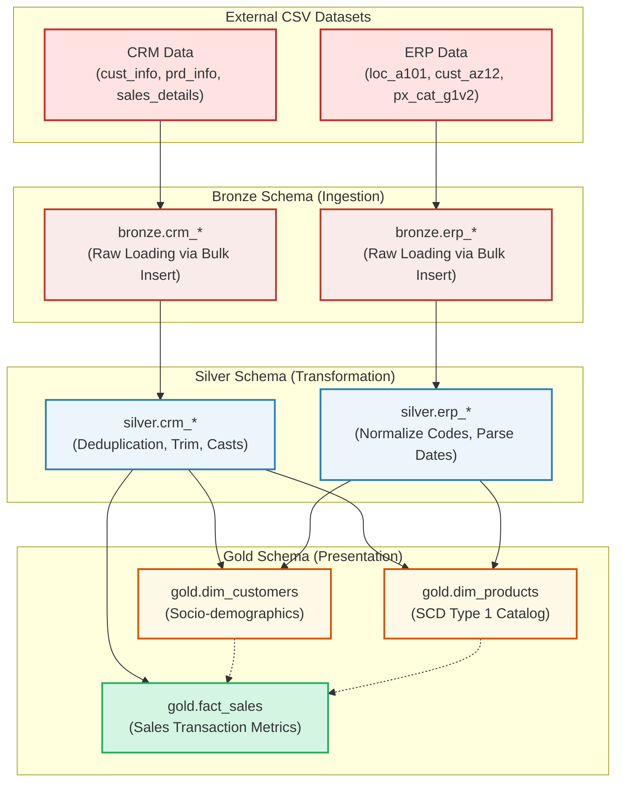

# MSSQL Medallion Data Warehouse

[](https://www.microsoft.com/en-us/sql-server)
[-blue)](https://www.databricks.com/glossary/medallion-architecture)
[-success)](#gold-layer-star-schema)
[](LICENSE)

An enterprise-grade, end-to-end SQL Data Warehouse (DWH) implementation leveraging **Microsoft SQL Server**. This project demonstrates the design, build, and orchestration of a multi-layered **Medallion Architecture** using raw datasets from disparate source systems (CRM and ERP), transforming them into a business-ready **Star Schema** optimized for analytical workloads.

---

## 📐 Architecture & Data Flow

This project implements a standard **Medallion Architecture** structured into three logical schemas:

1. **Bronze Layer (Raw Ingestion):** Direct replication of source CSV data into SQL tables with minimal alterations.
2. **Silver Layer (Cleaning & Standardization):** Data cleansing, deduplication, type casting, validation, and standardizing codes across source systems.
3. **Gold Layer (Analytical Modeling):** Stars-schema modeling with clean, business-aligned Dimension and Fact views ready for consumption by BI tools.



---

## 📁 Repository Structure

```tree
mssql-medallion-data-warehouse/
├── datasets/                 # Raw source CSV data files
│   ├── source_crm/           # Customer, product, and sales data from CRM
│   └── source_erp/           # Location, customer lookup, and product categories from ERP
├── docs/                     # Architectural diagrams, models, and naming guidelines
│   ├── data_catalog.md       # Data definitions and schemas
│   └── naming_conventions.md # Naming best practices for SQL objects
├── scripts/                  # SQL creation and ETL scripts
│   ├── init_database.sql     # Database creation and schema initialization
│   ├── bronze/               # Bronze layer DDL and ingestion procedures
│   ├── silver/               # Silver layer DDL and cleansing procedures
│   └── gold/                 # Gold layer DDL (Dimension & Fact views)
└── tests/                    # Data quality assurance checks
    ├── quality_checks_silver.sql
    └── quality_checks_gold.sql
```

---

## ⚡ ETL Transformations & Data Lineage

Here is how data moves and transforms from source files to analytical presentation views:

| Source File | Bronze Table | Silver Table | Gold View | Key Transformations |
| :--- | :--- | :--- | :--- | :--- |
| `cust_info.csv` | `bronze.crm_cust_info` | `silver.crm_cust_info` | `gold.dim_customers` | Deduplication (keeps latest by create date); trimming names; mapping marital status (`S`/`M` $\rightarrow$ `Single`/`Married`) and gender (`M`/`F` $\rightarrow$ `Male`/`Female`). |
| `LOC_A101.csv` | `bronze.erp_loc_a101` | `silver.erp_loc_a101` | `gold.dim_customers` | Removing hyphen formatting from keys; normalizing country codes (e.g., `DE` $\rightarrow$ `Germany`, `US` $\rightarrow$ `United States`). |
| `CUST_AZ12.csv` | `bronze.erp_cust_az12` | `silver.erp_cust_az12` | `gold.dim_customers` | Stripping `NAS` prefixes from ID keys; invalidating future birth dates; standardizing gender. |
| `prd_info.csv` | `bronze.crm_prd_info` | `silver.crm_prd_info` | `gold.dim_products` | Splitting compound product key to extract Category ID; mapping product lines; generating end dates (`LEAD()`). |
| `PX_CAT_G1V2.csv` | `bronze.erp_px_cat_g1v2`| `silver.erp_px_cat_g1v2` | `gold.dim_products` | Trimming whitespace; mapping product categories and maintenance terms. |
| `sales_details.csv` | `bronze.crm_sales_details`| `silver.crm_sales_details`| `gold.fact_sales` | Casting integers to `DATE` data types; deriving cost and pricing checks (`Sales = Qty * Price`). |

---

## 🚀 Setup & Execution Guide

### Prerequisites
- **Database Engine:** Microsoft SQL Server 2019 or later (Express, Developer, or Enterprise).
- **Interface Tool:** SQL Server Management Studio (SSMS) or Azure Data Studio.
- **Local Access:** Git installed for repository cloning.

---

### Step 1: Initialize Database & Schemas
Open SSMS, connect to your server instance, and execute [scripts/init_database.sql](file:///c:/Users/adenh/OneDrive/Desktop/tem/mssql-medallion-data-warehouse/scripts/init_database.sql).
This drops any existing database named `DataWarehouse`, initializes a fresh one, and registers the namespaces:
- `bronze`
- `silver`
- `gold`

---

### Step 2: Establish the DDL Table Structures
Run the following scripts in order to create the schema architectures:
1. **Bronze Layer DDL:** [scripts/bronze/ddl_bronze.sql](file:///c:/Users/adenh/OneDrive/Desktop/tem/mssql-medallion-data-warehouse/scripts/bronze/ddl_bronze.sql)
2. **Silver Layer DDL:** [scripts/silver/ddl_silver.sql](file:///c:/Users/adenh/OneDrive/Desktop/tem/mssql-medallion-data-warehouse/scripts/silver/ddl_silver.sql)
3. **Gold Layer DDL:** [scripts/gold/ddl_gold.sql](file:///c:/Users/adenh/OneDrive/Desktop/tem/mssql-medallion-data-warehouse/scripts/gold/ddl_gold.sql)

---

### Step 3: Run the Ingestion (ETL) Procedures

> [!IMPORTANT]
> The Bronze ETL uses `BULK INSERT` which requires absolute file paths. By default, the stored procedure [scripts/bronze/proc_load_bronze.sql](file:///c:/Users/adenh/OneDrive/Desktop/tem/mssql-medallion-data-warehouse/scripts/bronze/proc_load_bronze.sql) is set to point to `c:\Users\adenh\OneDrive\Desktop\tem\mssql-medallion-data-warehouse\datasets`. 
> If you have placed this project in a different directory, edit the paths in [proc_load_bronze.sql](file:///c:/Users/adenh/OneDrive/Desktop/tem/mssql-medallion-data-warehouse/scripts/bronze/proc_load_bronze.sql#L37-L122) first.

Run these scripts in SSMS to compile the stored procedures:
1. **Load Bronze Procedure:** Compile [scripts/bronze/proc_load_bronze.sql](file:///c:/Users/adenh/OneDrive/Desktop/tem/mssql-medallion-data-warehouse/scripts/bronze/proc_load_bronze.sql)
2. **Load Silver Procedure:** Compile [scripts/silver/proc_load_silver.sql](file:///c:/Users/adenh/OneDrive/Desktop/tem/mssql-medallion-data-warehouse/scripts/silver/proc_load_silver.sql)

To execute the pipelines:
```sql
-- Execute raw data ingestion
EXEC bronze.load_bronze;

-- Execute transformation, cleansing & standardization
EXEC silver.load_silver;
```

---

### Step 4: Quality Assurance Checks
Validate data integrity and formatting constraints by executing scripts within the `tests/` directory:
- [tests/quality_checks_silver.sql](file:///c:/Users/adenh/OneDrive/Desktop/tem/mssql-medallion-data-warehouse/tests/quality_checks_silver.sql) (Verifies formatting, trimming, and date normalization validations).
- [tests/quality_checks_gold.sql](file:///c:/Users/adenh/OneDrive/Desktop/tem/mssql-medallion-data-warehouse/tests/quality_checks_gold.sql) (Verifies primary key constraints, foreign key mappings, and relational schema validation).

---

## 🏆 Project Best Practices

- **Idempotence:** Every SQL script includes checks (e.g., `IF OBJECT_ID ... IS NOT NULL`) to safely recreate objects without causing database downtime or errors.
- **Strict Naming Convention:** Adheres to [naming_conventions.md](file:///c:/Users/adenh/OneDrive/Desktop/tem/mssql-medallion-data-warehouse/docs/naming_conventions.md) ensuring standardized suffixes for surrogate keys (`_key`), database layers (`bronze.*`, `silver.*`, `gold.*`), and stored procedures (`load_*`).
- **Data Deduplication:** Ensures that Bronze data duplication does not leak into analytical layers by using window partitioning logic.
- **Robust Error Handling:** ETL steps execute inside SQL `TRY...CATCH` blocks with logging of execution times and exception states.

---

## 📄 License
This project is licensed under the **MIT License** - see the [LICENSE](LICENSE) file for details.
